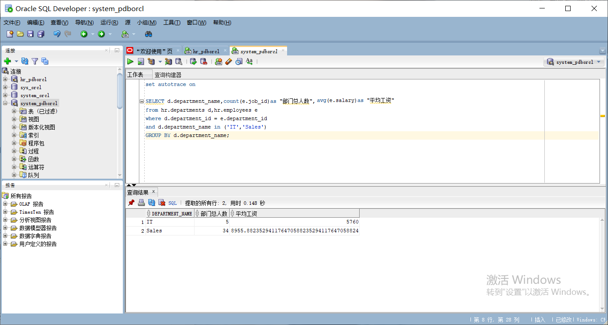
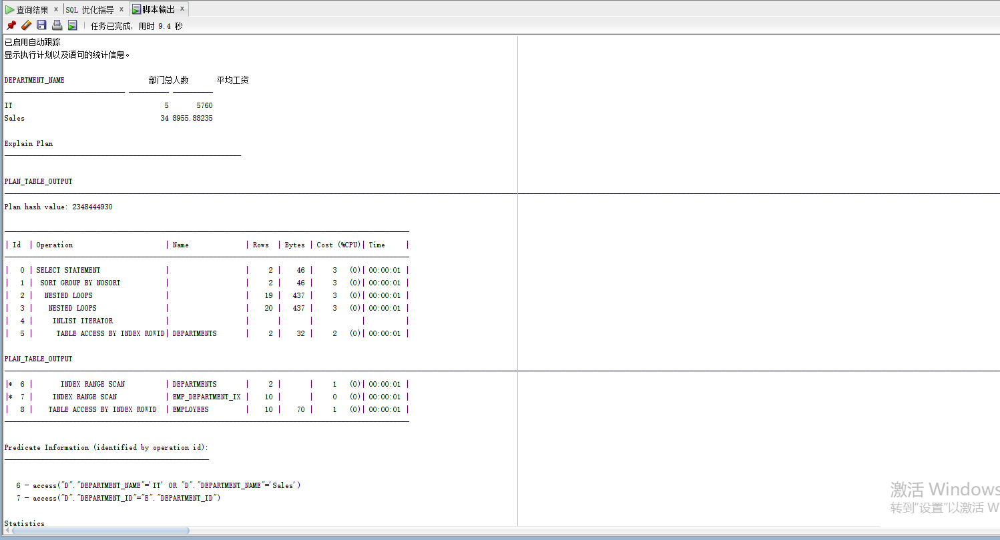
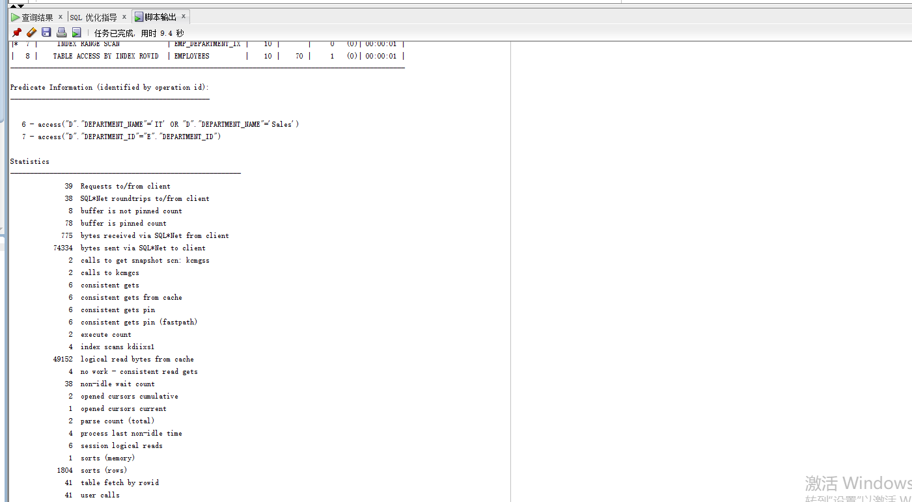
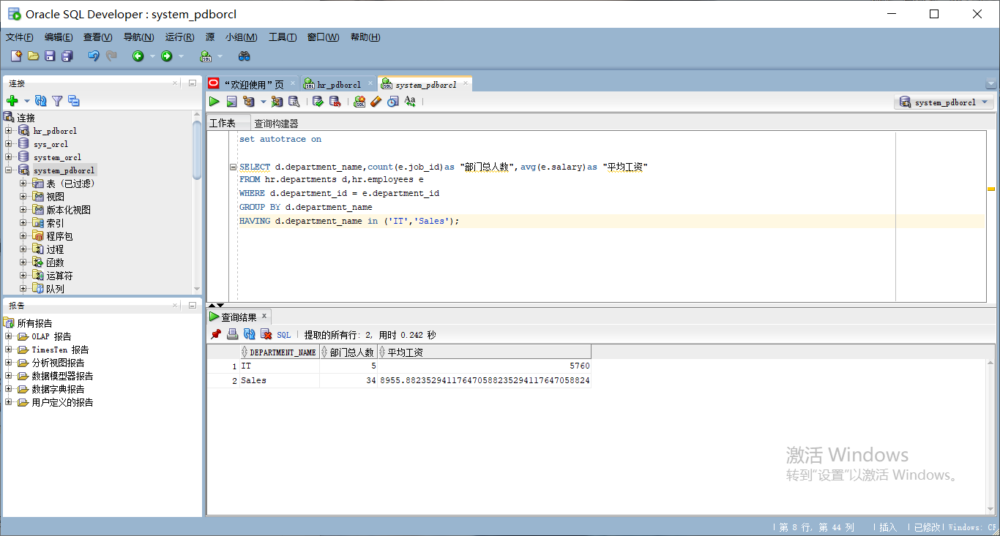
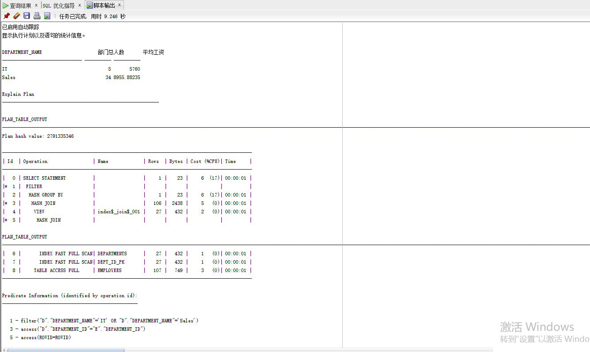
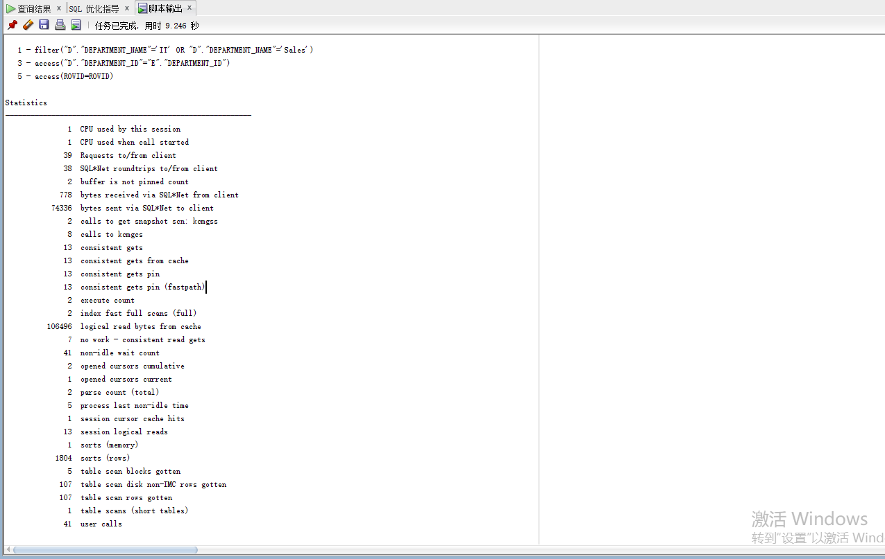
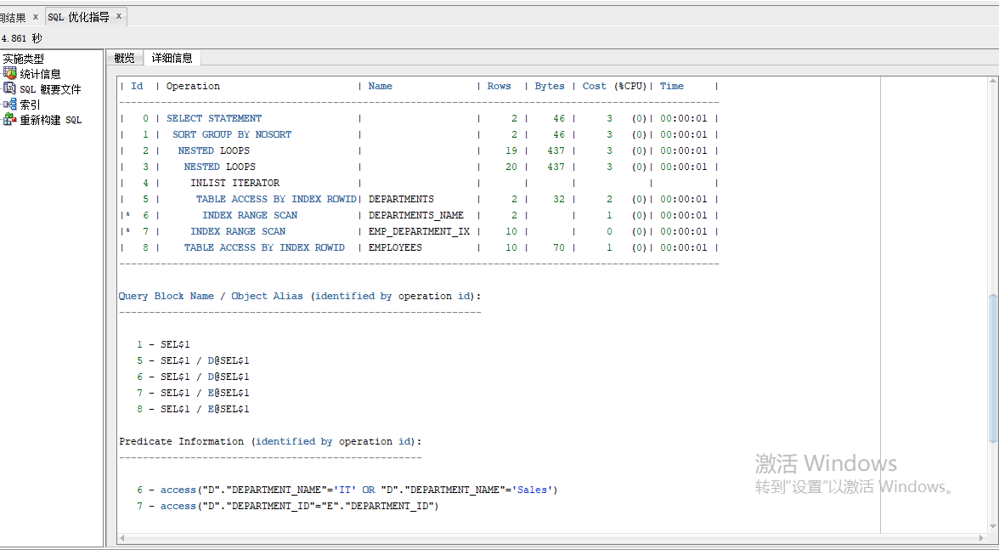
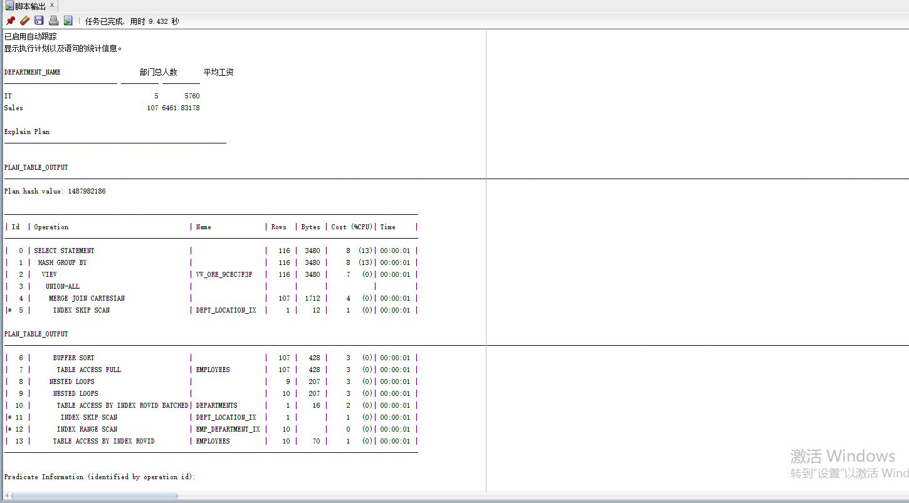
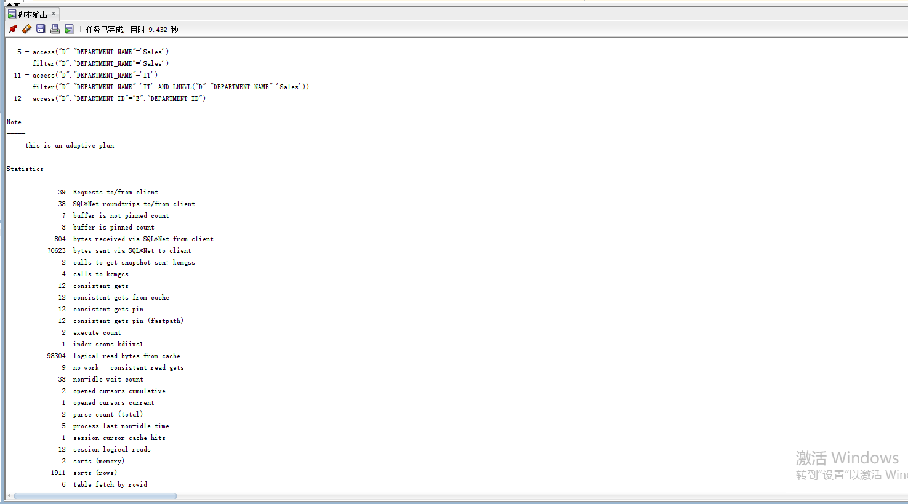
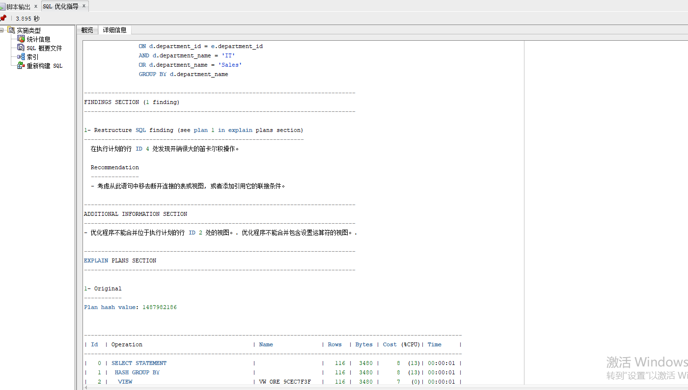

# 实验一：SQL语句的执行计划分析与优化指导

## 2班-201810414227-张洪铭

### 1、实验目的：

#### 分析SQL执行计划，执行SQL语句的优化指导。理解分析SQL语句的执行计划的重要作用。

### 2、实验内容：

#### （1）对Oracle12c中的HR人力资源管理系统中的表进行查询与分析。

#### （2）首先运行和分析教材中的样例：本训练任务目的是查询两个部门('IT'和'Sales')的部门总人数和平均工资，以下两个查询的结果是一样的。但效率不相同。

#### （3）设计自己的查询语句，并作相应的分析，查询语句不能太简单。

### 3、查询教材中的内容

#### （1）查询1：

```sql
set autotrace on

SELECT d.department_name,count(e.job_id)as "部门总人数",avg(e.salary)as "平均工资"
from hr.departments d,hr.employees e
where d.department_id = e.department_id
and d.department_name 
in ('IT','Sales')
GROUP BY d.department_name;
```

##### 查询结果



##### 执行计划





##### 分析

该查询语句通过从两个部门来查询部门的总人数和平均工资，通过创建一个或多个索引可以改进此语句的执行计划。建议考虑运行可以改进物理方案设计的访问指导或者创建推荐的索引。原理是创建推荐的索引可以显著地改进此语句的执行计划。但是，使用典型的SQL工作量运行“访问指导”可能比单个语句更可取。通过这种方法可以获得全面的索引建议案，包括计算索引维护的开销和附加的空间消耗。

#### （2）查询2：

```sql
set autotrace on

SELECT d.department_name,count(e.job_id)as "部门总人数",avg(e.salary)as "平均工资"
FROM hr.departments d,hr.employees e
WHERE d.department_id = e.department_id
GROUP BY d.department_name
HAVING d.department_name in ('IT','Sales');
```

##### 查询结果



##### 执行计划





##### 分析

该查询语句通过从HR的部门表和员工表按照部门分组，判断部门ID和员工ID是否对应，由having确认部门名字是IT和sales来查询部门总人数和平均工资。该查询语句比第一条查询语句要好一点，没有给出优化建议。

通过对两次不一样的SQL语句的执行计划分析，可以发现第一个语句的consistent gets为6，第二个语句的consistent gets为13，两个比较，应该是第一个语句更优。

### 优化指导信息



优化指导工具并没有给出优化建议

### 4、自己设计的代码：

```sql
SELECT d.department_name,count(e.job_id) as "部门总人数", avg(e.salary) as "平均工资" 
FROM hr.departments d 
INNER JOIN hr.employees e 
ON d.department_id = e.department_id 
AND d.department_name = 'IT' 
OR d.department_name = 'Sales' 
GROUP BY d.department_name
```

#### 执行计划





#### 分析

根据分析执行计划显示，我设计的语句consistent gets为12，之后再看优化指导。


