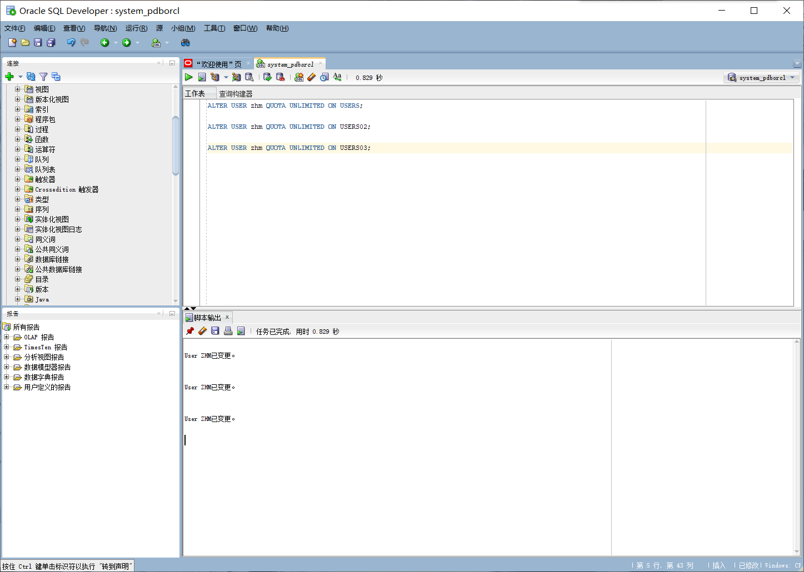
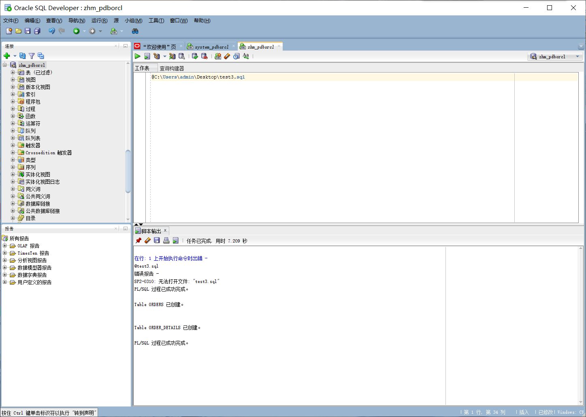
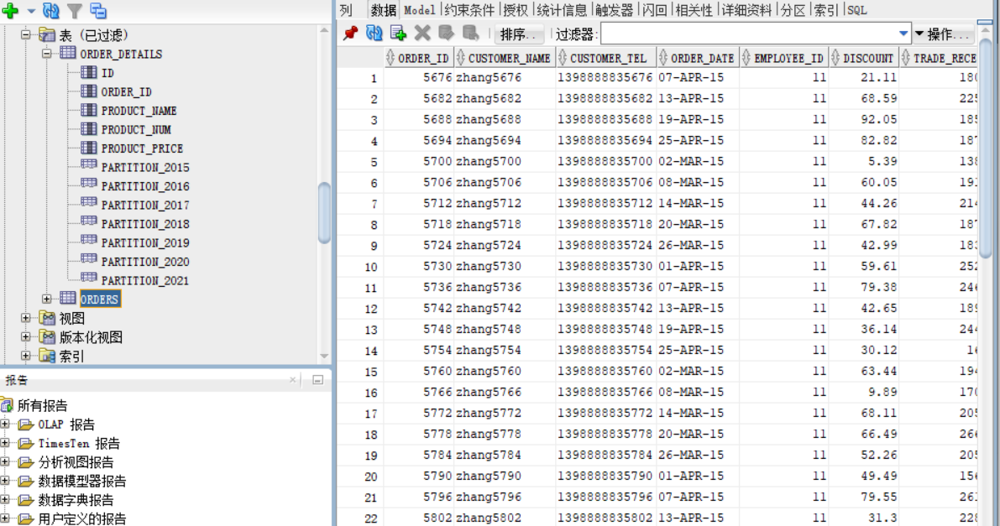
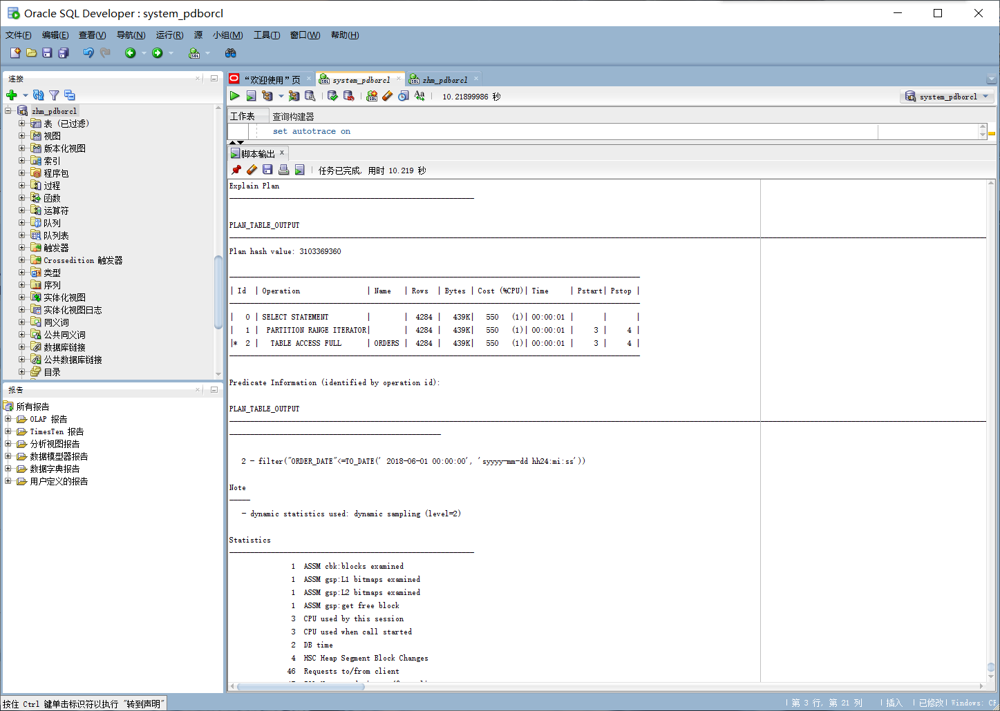
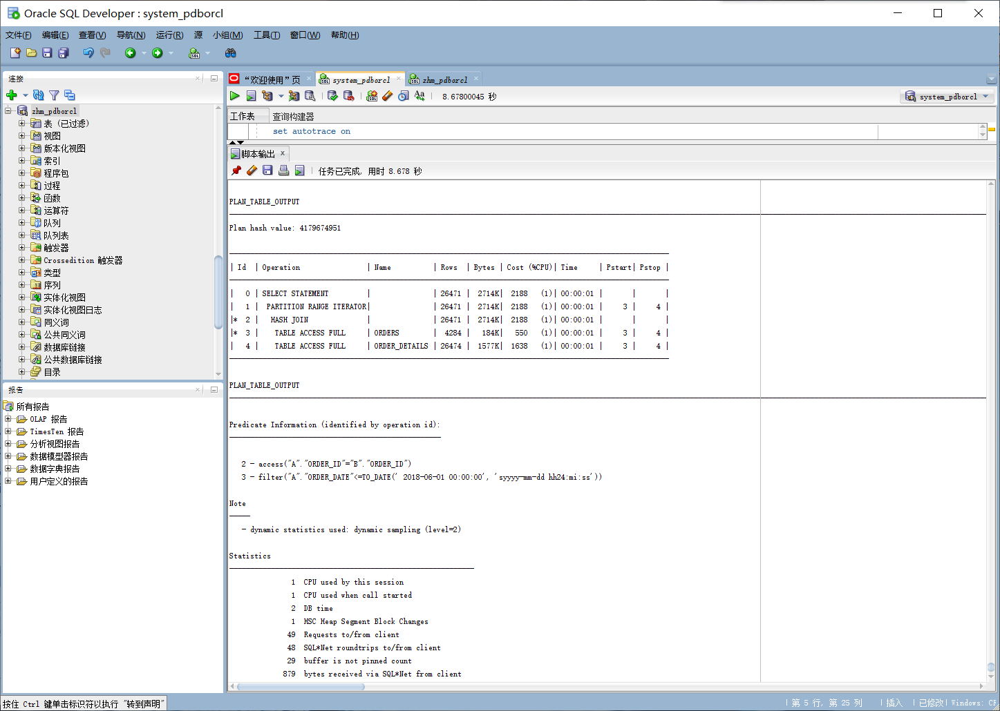
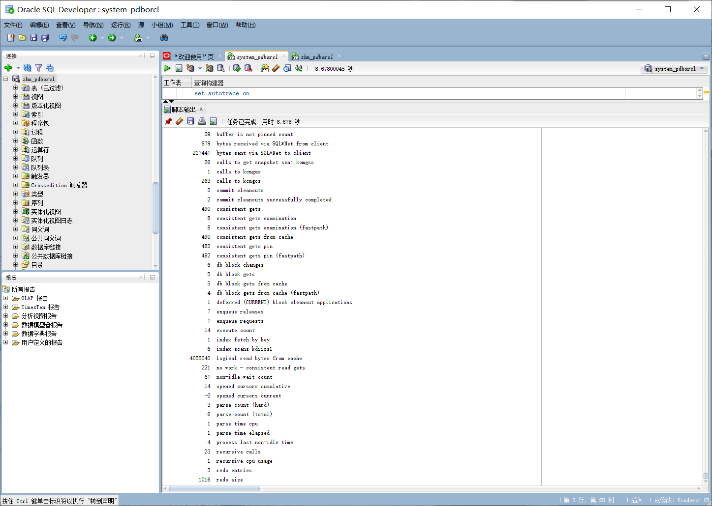
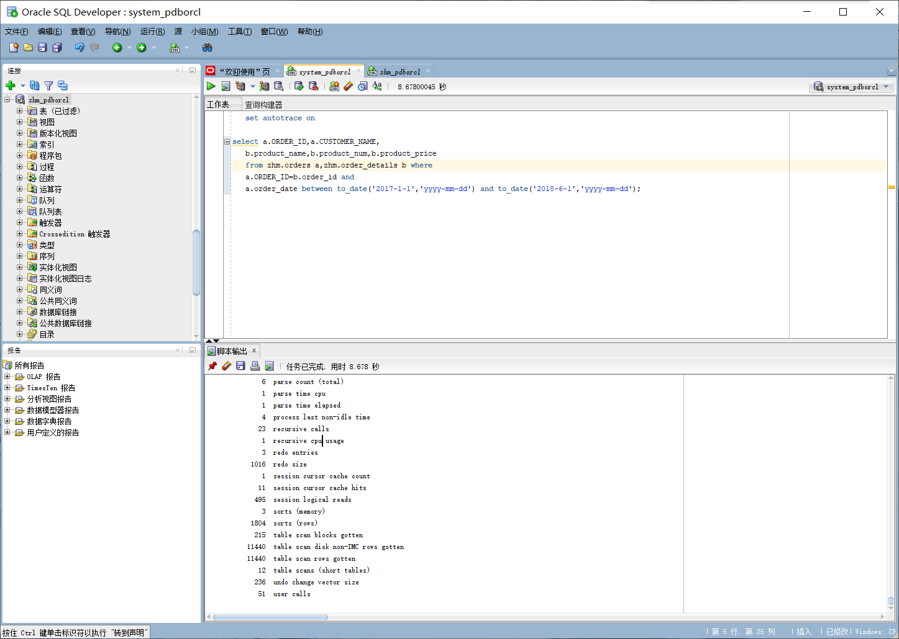
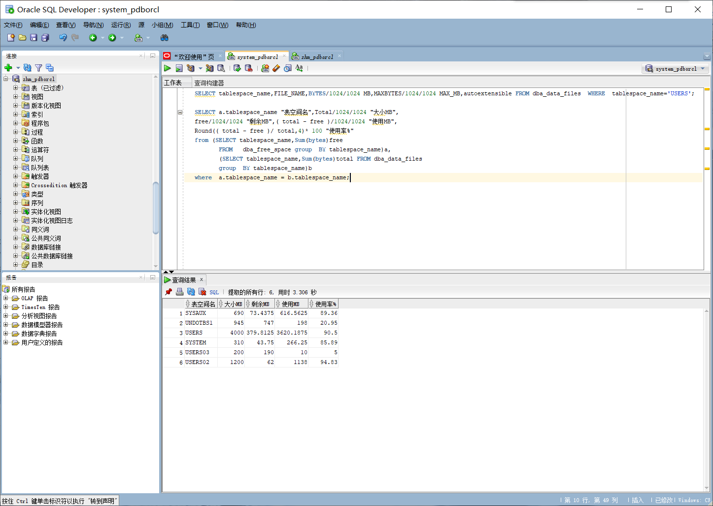

# 实验三 创建分区表

## 姓名：张洪铭  学号：201810414227   班级：18级软工2班

### 用户名：zhm

### 实验目的

掌握分区表的创建方法，掌握各种分区方式的使用场景。

### 实验内容

* 本实验使用3个表空间：USERS,USERS02,USERS03。在表空间中创建两张表：订单表(orders)与订单详表(order_details)。

* 使用你自己的账号创建本实验的表，表创建在上述3个分区，自定义分区策略。

* 你需要使用system用户给你自己的账号分配上述分区的使用权限。你需要使用system用户给你的用户分配可以查询执行计划的权限。

* 表创建成功后，插入数据，数据能并平均分布到各个分区。每个表的数据都应该大于1万行，对表进行联合查询。

* 写出插入数据的语句和查询数据的语句，并分析语句的执行计划。

* 进行分区与不分区的对比实验。

### 实验步骤

#### 步骤一

创建自己的账号zhm，然后以system身份登录,用户授权三个表空间所分配的空间没有限制:

``` sql
SQL>ALTER USER zhm QUOTA UNLIMITED ON USERS;

SQL>ALTER USER zhm QUOTA UNLIMITED ON USERS02;

SQL>ALTER USER zhm QUOTA UNLIMITED ON USERS03;

SQL>exit

```



#### 步骤二

以自己的账号zhm身份登录，并运行脚本文件test3.sql

SQL> @C:\Users\admin\Desktop\test3.sql



#### 步骤三

运行脚本文件之后，我们通过sqldeveloper可以看到两个表已经创建完成，数据也已经插入好了。



#### 步骤四

写查询数据的语句，并分析语句的执行计划。

```sql
set autotrace on

select * from zhm.orders where order_date
between to_date('2017-1-1','yyyy-mm-dd') and to_date('2018-6-1','yyyy-mm-dd');
```




```sql
set autotrace on

select a.ORDER_ID,a.CUSTOMER_NAME,
   b.product_name,b.product_num,b.product_price
   from zhm.orders a,zhm.order_details b 
   where a.ORDER_ID=b.order_id and
   a.order_date between to_date('2017-1-1','yyyy-mm-dd') and to_date('2018-6-1','yyyy-mm-dd');
```





#### 步骤五

查看数据库的使用情况，查看表空间的数据库文件，以及每个文件的磁盘占用情况。

```sql
  SELECT tablespace_name,FILE_NAME,BYTES/1024/1024 MB,MAXBYTES/1024/1024 MAX_MB,autoextensible FROM dba_data_files  WHERE  tablespace_name='USERS';

   SELECT a.tablespace_name "表空间名",Total/1024/1024 "大小MB",
   free/1024/1024 "剩余MB",( total - free )/1024/1024 "使用MB",
   Round(( total - free )/ total,4)* 100 "使用率%"
   from (SELECT tablespace_name,Sum(bytes)free
          FROM   dba_free_space group  BY tablespace_name)a,
          (SELECT tablespace_name,Sum(bytes)total FROM dba_data_files
          group  BY tablespace_name)b
   where  a.tablespace_name = b.tablespace_name;
```



#### 实验分析总结

通过操作步骤可以发现，orders表按照范围分区，通过订单日期进行分区。而orders与order_details表主外键关联，所以在order_details表使用引用分区进行存储。

通过分析执行计划，我们可以发现有分区查找数据的优势更大一些，速度快一些。所以如果数据量小，有分区与无分区差别不是很大，甚至无分区可能更快。如果数据量大，有分区的表优势明显加大。

查看了表空间的数据库文件，我们可以看到orders表按范围在USERS、USERS02、USERS03空间存储，USERS、USERS02表空间使用率高些，USERS03使用率低些。order_details表则全存储在USERS空间。
